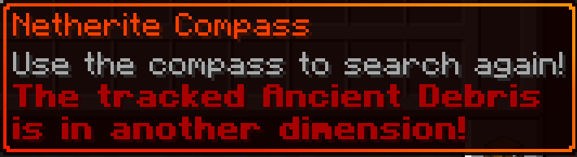

# Netherite Compass

![Java 21](https://img.shields.io/badge/language-Java%2021-9b599a.svg?style=flat-square&color=red&logo=data:image/png;base64,iVBORw0KGgoAAAANSUhEUgAAAEAAAABACAYAAACqaXHeAAAAAXNSR0IArs4c6QAAAARnQU1BAACxjwv8YQUAAAAJcEhZcwAADsMAAA7DAcdvqGQAAAhMSURBVHhe1Zt/pJ5lGMdPPyiKomg0GvXHobFDo9FoNDY2KkbR/tgf+6N06MTS/li2Pw4tTjqxtLRYRMXG0pnOWFosisVisVgURbEoFkXR9/M813XO/d7v8/N9n/t9375crud53vs8z3Nd9/Xrvu7nXLf82sdTk4Rtczt3nFlcOm2nyXG98UnCZinhLjtOjklUwF+ivflhekyiAu4T7coP02OiFCDTv0lsp2gmuzACTJoFzIlu50DKuAeeGhOjAAm8QWw+P8vwi/GkmAgFSPi7xZZFN2YXpqYuKxX+bcdJMXYFmKmfFa3JLuRYMp4cY1WAmf2XounsQo5/REfzw/QYmwIk/A6x86Jw5sERmf/3dpwcYymFJfxBsUP5WQ+uiGakgD/z01Xob+4Q2yRaL8JiTnRRMo9UARLiFrEPROT6GNdEmyTUt/lpNv5+sSdFj4kQHFwU7dG4b/LT4TAyBUiYe8VOiVyQEPj9Lgn1ESca+7DYAdFWzg2MWRAd0Lh/sysdYCQKkEAPiiF87O8OhD+pcaRDAmBsIT+JdmvM5/lpd0geBCXUQ2JxmgsxZ8Iz7oIoFv6caGMK4UFSBUioB8QocG7NLvQD4V/XONIh42IlvSfaqjG/5qfdI5kLSKjbxC6J1mYX+uHCswC6LFqXXV3Fon5/3o6TIaUFkObKhN+P8Hb8tCgWnhSXXHiQRAE2q2VNjaMS7hU7BruNO2iIoJSRIJUFkOqK/B5TZ8mbQYqiLtiYn63gghT0mx0nRyoFkLOLMCvhwlXencZDxO6QFKkU8IMoVsJVCf+pHTsw9xhrZRkUQiNBEgVI0D/EyP0hKGZ6oHGkN+r/GEXrhCRIZQEgXtJOm8/HOGI8xBaNZbWYHMkUoNmlrg+t4GZRUWZAUQTHGPNSwg12nAwpLQAg8O/5YYbZWCgLintEccygM7w9P0yHpAqQcD+KsZx14ej59y2FNe4rsbAh6vh/KwBIuDNiYWFTFuAOi+JAWVZJdobkCgBSwjtiKAFLmJEbPMr1EOYKceDsyxxdYyQKABLwLTF3h4WSAEf9EILuUVKMTAFASjgptkVEmTzLtQhhFbik8V/YcTIMtRzWLLLkpUFJPY+/sp53Iajy6AItSxCC4Qr0d3R+jon26ref7Vq4LKZbvF2/9TVHHTaeLEOg5B2wLBoqLLYaK661AoIHY86buRaAlIcfH9NLVLa2dR9cYFrjsiaozt8UIx3S9zuk66V9P41lMwULQllYVLymyHoNdlyJVgrQg2lN06IqamxeFdHSzma0DXRfqj7ueVx/39P90W9Uj1gXKZSZvqIxWfMU6HcmZL8ozC5YA8qt3V9oq4DnxBbzs0LQAaJtTX3PSzSJ4rgNVSJxgZl07i7ly2ruR60wL8H6rEPv9rIYinAw7iU7LkVbBdCnZyuraK2fErVdYb0bbfdwYXVK4x+341K0ygK6If5KiUqzko2MlCAlskmKaa+vEr4EvtNciYGzgPkeyiAD4JsEJEw2NOMYBElfGyAgmYLvAJhhONcg/LzV9rje5ykxJsZBNnjGjksxsAJimEI8Myzo4d9xfVTQ8z8TIyM4ss0WOy5FJ4WQHk5py8wdF7GBWdTkaAXdkxqjETSWLBIKj0U1+sZgaAvQw7eJsakRgkKGQuecZqGnCCqC7kF6Jc3hUhDC4FYUUvQRS1Or/pZvCsk8vqlCttipv2ERVosuFBCnnxju51DYA/Q44WmwDARbAiEbJT3pT8+mRiAreV2C8BRBb+Sn9ejCBVjGxv2/EAhHgMQ1mFkngifXq4QHRHPiSk/73KwGy3PhcUG20RoLD7oMguwAU8pSmyPYoGAWKaiYWRR7VkLRZF2BnkXOx8dxEwSnOCPqt/6wqjMFhLDZYcbwZ0ydqo6Zdj8FlM6YNxwicEKVX4jp3o+IsbmCkoZeMXaqAL0cCxwWSjQ/MM01esFWuzw2u6wpalNYF+haAe+LUQs4aHlTnFyMZ1VjqRuwDNwFZWEtxAnMGuACfAqTtJ7oMgawx086KoNXgbErVMEXQIdjBXaFxgow0yR6k69dAFLbeb3caf3OGh0fblSDtwBKpXHydX7aD7Mm7yu2Qq0CdHOqLPJwTxoKgBJIRzQyyOuYvaemQUElxz3pD9QGOb0jsYeguI/JyC42RKUCdOMXxcjzMZgVTJN2V9E3fSybSYee67GYODWGBRJEOyxLf7pnqw8l9TwKIu6Be/E9UeNP6EoVoJtSYjITsUmTstYVCT4u6F3fFvNtNwLnu3Zci6pKEG0W+TPf84ff740NEnyDiFWgC0/QpGXXGHUu8IlY2fYUlRirv0I3SAW9Ex1l3ol0G08EMeBVO26EOgXgWydEZUoAXrqyAoR7Q2OoD571bKpJYoc3Q735wnkM/J9F0If56Sp0Hz624H0KV5S1WQDoJk+IseLjJdrAcz9KAR74YlAQ4W5NV4gO0i5Zh2zRs14Aeu9nxQjiVKSFVtpIAQ7dkA8fMT0sYthUNwhQIJsf+Dmf0hVGe70nRRkLJOoWulMvcL0IrRQQQg+hY8My1ctYTJNUV9QLbAsExWog0iOE4JckTNVCiQnaJ/JyvHaHaWAFlEEvQVGCSZMtQiqDuwWxJGuOVgkZQ88jVvA5PZmAtYSD2EVKrAzQQylAD6cHgAVQG/B9X+tdobbQMwnMBENvrGCFYbomLvBJfV9ALEInFqCX4ktv/tuTF/Ks4CbsdE0v1WhpHFiRk2cClA3F9Ynnf/Yl2RBp/P8EKVyARRP5GXNkpuJg6Y2QMjTtJuEu+DhdI4Qe6OvSzhUQw0wWJTCDzCREmoO8W1QGLIc0SoxAYA+I9Bc6cLepqf8AXojoJWcg0jwAAAAASUVORK5CYII=)

![Mod loader: Fabric and Forge](https://img.shields.io/badge/modloader-Fabric_and_Forge-1976d2?style=flat-square&logo=data:image/png;base64,iVBORw0KGgoAAAANSUhEUgAAACAAAAAgCAYAAABzenr0AAAACXBIWXMAAAsTAAALEwEAmpwYAAAFHGlUWHRYTUw6Y29tLmFkb2JlLnhtcAAAAAAAPD94cGFja2V0IGJlZ2luPSLvu78iIGlkPSJXNU0wTXBDZWhpSHpyZVN6TlRjemtjOWQiPz4gPHg6eG1wbWV0YSB4bWxuczp4PSJhZG9iZTpuczptZXRhLyIgeDp4bXB0az0iQWRvYmUgWE1QIENvcmUgNS42LWMxNDIgNzkuMTYwOTI0LCAyMDE3LzA3LzEzLTAxOjA2OjM5ICAgICAgICAiPiA8cmRmOlJERiB4bWxuczpyZGY9Imh0dHA6Ly93d3cudzMub3JnLzE5OTkvMDIvMjItcmRmLXN5bnRheC1ucyMiPiA8cmRmOkRlc2NyaXB0aW9uIHJkZjphYm91dD0iIiB4bWxuczp4bXA9Imh0dHA6Ly9ucy5hZG9iZS5jb20veGFwLzEuMC8iIHhtbG5zOmRjPSJodHRwOi8vcHVybC5vcmcvZGMvZWxlbWVudHMvMS4xLyIgeG1sbnM6cGhvdG9zaG9wPSJodHRwOi8vbnMuYWRvYmUuY29tL3Bob3Rvc2hvcC8xLjAvIiB4bWxuczp4bXBNTT0iaHR0cDovL25zLmFkb2JlLmNvbS94YXAvMS4wL21tLyIgeG1sbnM6c3RFdnQ9Imh0dHA6Ly9ucy5hZG9iZS5jb20veGFwLzEuMC9zVHlwZS9SZXNvdXJjZUV2ZW50IyIgeG1wOkNyZWF0b3JUb29sPSJBZG9iZSBQaG90b3Nob3AgQ0MgMjAxOCAoV2luZG93cykiIHhtcDpDcmVhdGVEYXRlPSIyMDE4LTEyLTE2VDE2OjU0OjE3LTA4OjAwIiB4bXA6TW9kaWZ5RGF0ZT0iMjAxOS0wNy0yOFQyMToxNzo0OC0wNzowMCIgeG1wOk1ldGFkYXRhRGF0ZT0iMjAxOS0wNy0yOFQyMToxNzo0OC0wNzowMCIgZGM6Zm9ybWF0PSJpbWFnZS9wbmciIHBob3Rvc2hvcDpDb2xvck1vZGU9IjMiIHBob3Rvc2hvcDpJQ0NQcm9maWxlPSJzUkdCIElFQzYxOTY2LTIuMSIgeG1wTU06SW5zdGFuY2VJRD0ieG1wLmlpZDowZWRiMWMyYy1mZjhjLWU0NDEtOTMxZi00OTVkNGYxNGM3NjAiIHhtcE1NOkRvY3VtZW50SUQ9InhtcC5kaWQ6MGVkYjFjMmMtZmY4Yy1lNDQxLTkzMWYtNDk1ZDRmMTRjNzYwIiB4bXBNTTpPcmlnaW5hbERvY3VtZW50SUQ9InhtcC5kaWQ6MGVkYjFjMmMtZmY4Yy1lNDQxLTkzMWYtNDk1ZDRmMTRjNzYwIj4gPHhtcE1NOkhpc3Rvcnk+IDxyZGY6U2VxPiA8cmRmOmxpIHN0RXZ0OmFjdGlvbj0iY3JlYXRlZCIgc3RFdnQ6aW5zdGFuY2VJRD0ieG1wLmlpZDowZWRiMWMyYy1mZjhjLWU0NDEtOTMxZi00OTVkNGYxNGM3NjAiIHN0RXZ0OndoZW49IjIwMTgtMTItMTZUMTY6NTQ6MTctMDg6MDAiIHN0RXZ0OnNvZnR3YXJlQWdlbnQ9IkFkb2JlIFBob3Rvc2hvcCBDQyAyMDE4IChXaW5kb3dzKSIvPiA8L3JkZjpTZXE+IDwveG1wTU06SGlzdG9yeT4gPC9yZGY6RGVzY3JpcHRpb24+IDwvcmRmOlJERj4gPC94OnhtcG1ldGE+IDw/eHBhY2tldCBlbmQ9InIiPz4/HiGMAAAAtUlEQVRYw+XXrQqAMBQF4D2P2eBL+QIG8RnEJFaNBjEum+0+zMQLtwwv+wV3ZzhhMDgfJ0wUSinxZUQWgKos1JP/AbD4OneIDyQPwCFniA+EJ4CaXm4TxAXCC0BNHgLhAdAnx9hC8PwGSRtAFVMQjF7cNTWED8B1cgwW20yfJgAvrssAsZ1cB3g/xckAxr6FmCDU5N6f488BrpCQ4rQBJkiMYh4ACmLzwOQF0CExinkCsvw7vgGikl+OotaKRwAAAABJRU5ErkJggg==)

![Modrinth](https://img.shields.io/badge/modrinth-Netherite_Compass-1bd96a?style=flat-square&color=1bd96a&link=https%3A%2F%2Fmodrinth.com%2Fmod%2Fnetherite-compass&logo=data:image/svg+xml;base64,PHN2ZyB3aWR0aD0iNTEyIiBoZWlnaHQ9IjUxNCIgdmlld0JveD0iMCAwIDUxMiA1MTQiIGZpbGw9Im5vbmUiIHhtbG5zPSJodHRwOi8vd3d3LnczLm9yZy8yMDAwL3N2ZyI+CiAgPHBhdGggZmlsbC1ydWxlPSJldmVub2RkIiBjbGlwLXJ1bGU9ImV2ZW5vZGQiIGQ9Ik01MDMuMTYgMzIzLjU2QzUxNC41NSAyODEuNDcgNTE1LjMyIDIzNS45MSA1MDMuMiAxOTAuNzZDNDY2LjU3IDU0LjIyOTkgMzI2LjA0IC0yNi44MDAxIDE4OS4zMyA5Ljc3OTkxQzgzLjgxMDEgMzguMDE5OSAxMS4zODk5IDEyOC4wNyAwLjY4OTk0MSAyMzAuNDdINDMuOTlDNTQuMjkgMTQ3LjMzIDExMy43NCA3NC43Mjk4IDE5OS43NSA1MS43MDk4QzMwNi4wNSAyMy4yNTk4IDQxNS4xMyA4MC42Njk5IDQ1My4xNyAxODEuMzhMNDExLjAzIDE5Mi42NUMzOTEuNjQgMTQ1LjggMzUyLjU3IDExMS40NSAzMDYuMyA5Ni44MTk4TDI5OC41NiAxNDAuNjZDMzM1LjA5IDE1NC4xMyAzNjQuNzIgMTg0LjUgMzc1LjU2IDIyNC45MUMzOTEuMzYgMjgzLjggMzYxLjk0IDM0NC4xNCAzMDguNTYgMzY5LjE3TDMyMC4wOSA0MTIuMTZDMzkwLjI1IDM4My4yMSA0MzIuNCAzMTAuMyA0MjIuNDMgMjM1LjE0TDQ2NC40MSAyMjMuOTFDNDY4LjkxIDI1Mi42MiA0NjcuMzUgMjgxLjE2IDQ2MC41NSAzMDguMDdMNTAzLjE2IDMyMy41NloiIGZpbGw9IiMxYmQ5NmEiLz4KICA8cGF0aCBkPSJNMzIxLjk5IDUwNC4yMkMxODUuMjcgNTQwLjggNDQuNzUwMSA0NTkuNzcgOC4xMTAxMSAzMjMuMjRDMy44NDAxMSAzMDcuMzEgMS4xNyAyOTEuMzMgMCAyNzUuNDZINDMuMjdDNDQuMzYgMjg3LjM3IDQ2LjQ2OTkgMjk5LjM1IDQ5LjY3OTkgMzExLjI5QzUzLjAzOTkgMzIzLjggNTcuNDUgMzM1Ljc1IDYyLjc5IDM0Ny4wN0wxMDEuMzggMzIzLjkyQzk4LjEyOTkgMzE2LjQyIDk1LjM5IDMwOC42IDkzLjIxIDMwMC40N0M2OS4xNyAyMTAuODcgMTIyLjQxIDExOC43NyAyMTIuMTMgOTQuNzYwMUMyMjkuMTMgOTAuMjEwMSAyNDYuMjMgODguNDQwMSAyNjIuOTMgODkuMTUwMUwyNTUuMTkgMTMzQzI0NC43MyAxMzMuMDUgMjM0LjExIDEzNC40MiAyMjMuNTMgMTM3LjI1QzE1Ny4zMSAxNTQuOTggMTE4LjAxIDIyMi45NSAxMzUuNzUgMjg5LjA5QzEzNi44NSAyOTMuMTYgMTM4LjEzIDI5Ny4xMyAxMzkuNTkgMzAwLjk5TDE4OC45NCAyNzEuMzhMMTc0LjA3IDIzMS45NUwyMjAuNjcgMTg0LjA4TDI3OS41NyAxNzEuMzlMMjk2LjYyIDE5Mi4zOEwyNjkuNDcgMjE5Ljg4TDI0NS43OSAyMjcuMzNMMjI4Ljg3IDI0NC43MkwyMzcuMTYgMjY3Ljc5QzIzNy4xNiAyNjcuNzkgMjUzLjk1IDI4NS42MyAyNTMuOTggMjg1LjY0TDI3Ny43IDI3OS4zM0wyOTQuNTggMjYwLjc5TDMzMS40NCAyNDkuMTJMMzQyLjQyIDI3My44MkwzMDQuMzkgMzIwLjQ1TDI0MC42NiAzNDAuNjNMMjEyLjA4IDMwOC44MUwxNjIuMjYgMzM4LjdDMTg3LjggMzY3Ljc4IDIyNi4yIDM4My45MyAyNjYuMDEgMzgwLjU2TDI3Ny41NCA0MjMuNTVDMjE4LjEzIDQzMS40MSAxNjAuMSA0MDYuODIgMTI0LjA1IDM2MS42NEw4NS42Mzk5IDM4NC42OEMxMzYuMjUgNDUxLjE3IDIyMy44NCA0ODQuMTEgMzA5LjYxIDQ2MS4xNkMzNzEuMzUgNDQ0LjY0IDQxOS40IDQwMi41NiA0NDUuNDIgMzQ5LjM4TDQ4OC4wNiAzNjQuODhDNDU3LjE3IDQzMS4xNiAzOTguMjIgNDgzLjgyIDMyMS45OSA1MDQuMjJaIiBmaWxsPSIjMWJkOTZhIi8+Cjwvc3ZnPg==)

## About the mod

This mod adds the Netherite Compass to your game which helps you track down Ancient Debris blocks in you world.

### Behaviour:

#### Tracking:

The Netherite Compass will point to the nearest Ancient Debris in you 3x3 chunk area. If it finds an Ancient Debris block it will lock onto it and will point to it (even if you move and another Ancient Debris is closer) until the block is broken.

#### Locating:

If the compass didn't managed to find Ancient Debris in your nearby are it will start spinning. This means its continuously looking for them while you have it on you.

#### Changing Dimensions:

If you go to another dimension and your compass is locked onto an Ancient Debris, it will warn you in its description that the Ancient Debris is in another dimension. It will start wobbling around like the default compass when it can't find its target.

#### Using the compass:

When you right click the compass it will try to search for a new target if it already had one. This action will give you a five second cooldown before you can use it again (just like the ender pearl when thrown).

#### Droped and Item frames

The compass **will not** change its state if its droped or in an Item frame. For example, if its in the "Locating..." state and you put into an Item frame it **will not** lock onto an Ancient Debris if you place one nearby, like it would if you had it in your inventory.

### Crafting

Old crafting recipe used to require a lot of netherite, making the item useless as the player could have already crafted all the netherite gear and tools from the required amount of netherite. This new recipe encourages exploration and gives a fair reward for conquering two harder structures. 

In order to obtain the Netherite Compass the player have to put three items into the **Smithing Table**:

 - **Netherite Upgrade Smithing Template**
 - **Recovery Compass**
 - **Netherite Ingot**

### Other notes

The compass will not show height offcourse, just like the others already in game, but it is already powerful enough so it probably don't need to.

### Loading worlds without the mod

If you **load up a world without the mod**, which you previously used it with, only the compass will disappear, the **Ancient Debris Blocks will not be affected, they won't disappear from your world**.

## Building from source

#### Prerequisites

- Java 21 or above

#### Compiling

Navigate to the directory you've cloned this repository and launch a build with Gradle using `gradlew build` (Windows)
or `./gradlew build` (macOS/Linux). If you are not using the Gradle wrapper, simply replace `gradlew` with `gradle`
or the path to it.

The initial setup may take a few minutes. After Gradle has finished building everything, you can find the resulting
artifacts in `build/libs`.

## License

This mod is licensed under MIT, a free and open-source license. For more information, please see the
[license file](LICENSE).
